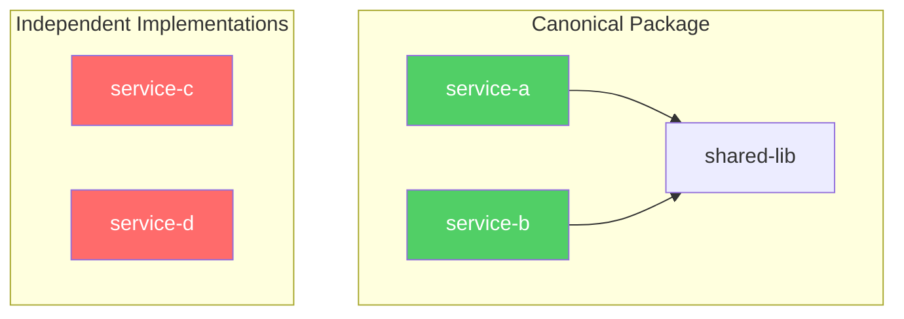

<!-- Preserved pre-Codex/Synor import. -->
---
name: codebase-audit
description: Deep audit of cross-cutting concerns across the codebase. Use when asked to "audit", "check consistency", "how do we do X everywhere", "find all patterns", "consolidation", "fragmentation", "codebase health", or investigating how a pattern (logging, errors, config, caching, tracing) is implemented across services.
---

# Codebase Cross-Cutting Audit

You are conducting an exhaustive audit of cross-cutting concerns across the trifetch monorepo.

## When to Use

- Investigating how a specific pattern is implemented across all services
- Checking consistency/fragmentation of logging, errors, config, caching, tracing, etc.
- Understanding whether shared packages exist and are actually used
- Auditing whether CLAUDE.md and skills steer developers to the right patterns

## Execution Strategy

Launch **3 parallel Opus subagents** (Task tool, `subagent_type=Explore`, `model=opus`) to maximize coverage without polluting main context. All 3 must be launched in a **single message** for true parallelism.

### Agent 1: Pattern Inventory

> "Very thorough exploration. Find ALL implementations of [PATTERN] across the entire codebase at [REPO_ROOT]. Search apps/, packages/, and any other source directories. For each implementation found, report: file path, import/require statement, library used, how it's instantiated, whether it produces structured output, and who consumes it. Check package.json files for relevant dependencies. Be exhaustive."

### Agent 2: Consolidation & Fragmentation Analysis

> "Very thorough exploration. For [PATTERN] across [REPO_ROOT], assess: how many distinct implementations exist, whether a canonical/shared version exists (and if so, which services ignore it), what the fragmentation score is. Look for duplicate utility code, copy-pasted boilerplate, and services that roll their own instead of using shared packages. Identify the top consolidation opportunities ranked by impact."

### Agent 3: Documentation & Skill Coverage

> "Very thorough exploration of [REPO_ROOT]. Check whether CLAUDE.md and .claude/skills/ adequately guide developers to use the right [PATTERN]. For each skill, check if its trigger keywords would route a developer asking about [PATTERN] to the correct skill. Identify: skills that exist but are unlisted in CLAUDE.md, keyword trigger gaps where the wrong skill gets activated, and cross-cutting concerns with zero skill coverage."

## Synthesis

After all 3 agents return, synthesize into:

### 1. Pattern Inventory Table

| # | Approach | Library | Where Used | Structured? | Shared Package? |
|---|----------|---------|------------|-------------|-----------------|
| 1 | ... | ... | ... | ... | ... |

### 2. Consolidation Scorecard

| Category | Score | Canonical Package | Biggest Issue |
|----------|-------|-------------------|---------------|
| ... | Well / Partial / Fragmented / Highly Fragmented | Yes/No | ... |

### 3. Mermaid Diagrams

Always produce at least one mermaid diagram showing the pattern landscape. Use color coding:
- Green (`fill:#51cf66`): Well consolidated, uses shared package
- Yellow (`fill:#ffd43b`): Partially consolidated, shared package exists but not universally adopted
- Orange (`fill:#ff922b`): Fragmented, multiple independent implementations
- Red (`fill:#ff6b6b`): Highly fragmented or completely unstructured

Example structure:

### 4. CLAUDE.md & Skill Gap Table

| Developer Asks... | Gets Routed To | Should Go To | Gap? |
|-------------------|---------------|--------------|------|
| ... | ... | ... | Yes/No |

### 5. Recommendations

Prioritized list:
- **Quick wins**: Things that can be fixed in CLAUDE.md or skill files today
- **Medium-term**: Shared packages to extract, skills to create
- **Long-term**: Architectural consolidation work

## Default Audit Targets

If the user doesn't specify a pattern, audit all of these:
1. **Logging** -- logger libraries, structured vs unstructured, trace context
2. **Error handling** -- custom error classes, Effect TaggedError, error middleware
3. **Configuration** -- env var loading, validation, sharing across packages
4. **Caching** -- Redis, in-memory, disk, S3, cache invalidation
5. **Telemetry/Tracing** -- OpenTelemetry setup, custom spans, Sentry
6. **HTTP clients** -- retry logic, circuit breakers, tracing propagation
7. **Validation** -- Zod schemas, Effect schemas, input validation

## Key Principle

The goal is not just to find patterns -- it's to answer: **"If a new developer joins and needs to add [PATTERN] to a service, will they find the right approach, or will they invent a 6th way?"**

Check CLAUDE.md, check skills, check shared packages. Close the loop.
