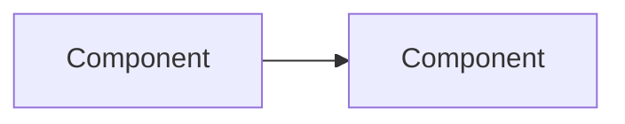
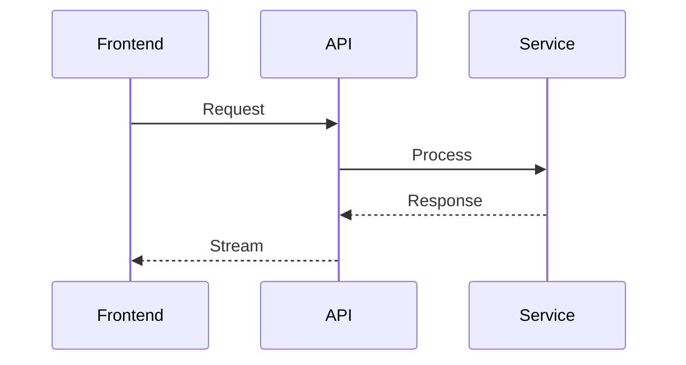

<!-- Preserved pre-Codex/Synor import. -->
---
name: plan-with-docs
description: Deep planning with documentation research. Use when user asks to "plan", "design", "implement", "add feature", "build", "create", or needs architectural design. Enforces docs-by-default approach with Context7 and comprehensive research before execution.
---

# Feature Planning Skill

**MANDATORY**: Use this skill when planning any non-trivial feature implementation.

## Workflow

### 1. Research Phase (ALWAYS FIRST)

Before writing ANY code, research using these tools:

```
1. Context7 MCP - Query relevant library docs
2. Explore codebase - Find existing patterns
3. Check .context/ - External SDK sources if available
4. Web search - For unfamiliar technologies
```

**Never skip research.** Even for "simple" features.

### 2. Parallel Deep-Dive with Subagents

**Launch 3 Explore subagents in parallel** to analyze the proposed solution:

```typescript
// Launch these IN PARALLEL using Task tool with subagent_type=Explore:

// Subagent 1: Coding Practices & Tech Fit
"Analyze how [feature] fits with our existing coding practices and tech stack:
- Does it follow existing patterns in the codebase?
- Are we using the right libraries/tools for this?
- Does it integrate well with our current architecture?
- Check CLAUDE.md, .ruler/, and existing similar implementations"

// Subagent 2: Security Analysis
"Think through security implications for [feature]:
- Authentication/authorization concerns
- Data validation and sanitization
- Secrets handling
- Attack vectors (injection, XSS, CSRF, etc.)
- Data exposure risks
- Rate limiting / DoS protection"

// Subagent 3: Production Quality Assessment
"Evaluate if this is great quality production code:
- Error handling coverage
- Logging and observability
- Performance implications
- Scalability concerns
- Testing strategy
- Graceful degradation
- Monitoring and alerting needs"
```

**Synthesize findings** from all 3 subagents into the spec.

### 3. Spec Document Structure

Create a spec with this structure:

```markdown
# Feature: [Name]

## Problem Statement
What problem are we solving? Why now?

## Current State
How does the system work today? Diagram it.

## Proposed Solution
High-level approach. Diagram the new flow.

## Architecture


## Coding Practices & Tech Fit
- How does this align with existing patterns?
- What existing code can we reference?
- Are we using the right tools for the job?
- Integration points with current architecture

## Security Considerations
- [ ] Auth/authz handled correctly?
- [ ] Input validation in place?
- [ ] Secrets managed securely?
- [ ] Attack vectors mitigated?
- [ ] Data exposure risks addressed?

## Production Quality Checklist
- [ ] Comprehensive error handling?
- [ ] Proper logging/observability?
- [ ] Performance acceptable?
- [ ] Scales appropriately?
- [ ] Tests planned?
- [ ] Graceful degradation?
- [ ] Monitoring/alerting needs?

## Open Questions
- [ ] Question 1?
- [ ] Question 2?

## User Decisions & Answers
<!-- Keep this concise - capture key decisions from user during spec iteration -->
| Question | User Answer | Implications |
|----------|-------------|--------------|
| Example: 1 EFS per sandbox? | Yes, isolated | Need per-workflow EFS provisioning |

## Decisions Made
| Decision | Rationale | Date |
|----------|-----------|------|
| Use X over Y | Because Z | 2024-01-29 |

## Edge Cases & Failure Modes
- What if X fails?
- What if Y is interrupted?
- What about race conditions?

## Implementation Plan
1. Step 1
2. Step 2
3. Step 3

## Files to Modify
- `path/to/file.ts` - Description of changes
```

### 4. Iterative Refinement

After initial spec:
1. **Ask clarifying questions** - Don't assume
2. **Update "User Decisions & Answers"** - Capture every answer concisely
3. **Identify dependencies** - What blocks what?
4. **Surface edge cases** - What could go wrong?

**Keep the spec as living document** - Update it with each user response. The "User Decisions & Answers" table is the source of truth for what the user has decided.

### 5. Mermaid Diagrams (REQUIRED)

Always draw diagrams for:
- Data flow between components
- State machines / event flows
- Before/after architecture comparisons
- Sequence diagrams for complex interactions



### 6. Checklist Before Implementation

- [ ] Researched relevant docs (Context7)
- [ ] Explored existing codebase patterns
- [ ] Drew architecture diagrams
- [ ] **Ran 3 subagent deep-dives** (practices, security, quality)
- [ ] Listed all edge cases
- [ ] Captured open questions
- [ ] Got user approval on approach

## Anti-Patterns

**DON'T:**
- Jump straight to code
- Assume you know how libraries work
- Skip diagramming "simple" features
- Leave questions unasked
- Forget failure modes
- Skip the security review
- Ignore production quality concerns

**DO:**
- Research first, always
- Ask dumb questions early
- Diagram everything
- Capture decisions with rationale
- Consider what happens when things fail
- **Use subagents for deep analysis** (parallel = faster)
- Think like an attacker (security)
- Think like an SRE (production quality)

## Integration with Other Skills

- Use `architecture` skill for codebase exploration
- Use `database` skill for schema changes
- Use `pulumi` skill for infra changes
- Use `temper-design` skill for UI components
- Use `observability` skill for logging/monitoring patterns
- Use `testing` skill for test strategy
