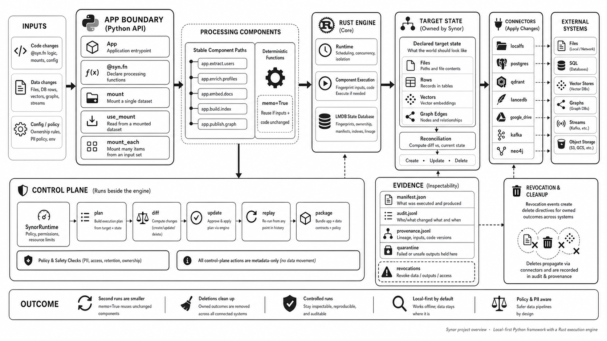

<p align="center">
  <picture>
    <source media="(prefers-color-scheme: dark)" srcset="docs/public/images/synor-wordmark-dark.svg">
    <source media="(prefers-color-scheme: light)" srcset="docs/public/images/synor-wordmark-light.svg">
    
  </picture>
</p>

<h1 align="center">Incremental data pipelines for AI and data systems.</h1>

<p align="center">
  <strong>Write the transformation in Python. Synor detects what changed,
  runs the affected work, and reconciles every owned outcome.</strong>
</p>

Synor is a local-first Python framework with a Rust execution engine for
building reliable data processing pipelines. It can power AI indexing, RAG
ingestion, document extraction, knowledge graphs, conventional ETL, and
stream-to-store workflows without introducing a separate pipeline DSL.

The closest category is an **incremental dataflow and reconciliation
framework**. Synor can be used as the engine inside an AI ETL system, but it is
not limited to AI and it is not a hosted data platform. Models are optional.
The core job is to keep derived files, rows, vectors, and graph edges aligned
with the inputs and code that produced them, and to publish keyed changes to
streams.

<p align="center">
  <picture>
    <source media="(prefers-color-scheme: dark)" srcset="docs/public/images/synor-project-overview-dark.png">
    <source media="(prefers-color-scheme: light)" srcset="docs/public/images/synor-project-overview-light.png">
    
  </picture>
</p>

> [!IMPORTANT]
> Synor is currently an alpha release intended for local evaluation. The
> current version is `0.1.0a1`.

For a slower conceptual pass through the diagram and execution model, read
[reading.md](reading.md).

## Why Synor

Most pipelines are straightforward on the first run. The difficult part is
keeping outputs correct after a file changes, code is edited, a row disappears,
a model is replaced, or a run is interrupted.

Synor handles that lifecycle through three ideas:

1. **Observe change.** Fingerprint function inputs, code, and declared
   dependencies against a local change ledger.
2. **Own work.** Give each processing component a stable path and a precise set
   of outcomes that it owns.
3. **Reconcile state.** Create, update, leave alone, or remove target states so
   connected systems match the current declaration.

That model provides:

- **Incremental execution:** `@syn.task(cache=True)` reuses work whose inputs and
  implementation have not changed.
- **Automatic cleanup:** when an input or component disappears, the outcomes it
  owned are removed from supported targets.
- **Declarative writes:** pipeline code declares the desired files, rows,
  vectors, and graph relationships instead of maintaining separate upsert and
  delete branches.
- **Ordinary Python composition:** use async functions, dataclasses, Pydantic,
  third-party libraries, local models, hosted APIs, and your existing code.
- **Local-first execution:** the Python package, Rust engine, and LMDB change
  ledger run on your machine. Synor does not send usage telemetry.
- **Inspectable operation:** preview changes, enforce execution policy, and
  retain metadata-only evidence around controlled runs.

## What you can build

Synor is useful wherever derived data must stay synchronized with changing
source data:

- **AI and RAG indexing:** split documents, generate embeddings, and maintain a
  vector index without rebuilding unchanged documents.
- **Structured extraction:** turn PDFs, audio, notes, or other unstructured
  content into typed database records with local or hosted models.
- **Knowledge graphs:** extract entities and relationships, then reconcile
  shared nodes and edges as source documents evolve.
- **ETL and enrichment:** read files, object stores, database rows, or streams,
  transform them in Python, and write to operational or analytical stores.
- **Continuous data products:** catch up once, then keep the same pipeline live
  as files, rows, or events change.
- **Governed indexes:** track ownership and provenance, apply egress and PII
  policy, and operate strict revocation flows through supported boundaries.

## The pipeline surface

### Sources

Read from local files, Amazon S3 and compatible stores, Azure Blob Storage,
Google Drive, OCI Object Storage, Postgres, Kafka, and Apache Iggy. Source
connectors expose stable keyed items or event streams. Keyed inputs let Synor
process only the items that changed.

### Transformations

Use any Python function or library. Synor also includes operations for
syntax-aware text and code splitting, local Sentence Transformers embeddings,
hosted embeddings and audio transcription through LiteLLM, and entity
resolution.

### Targets

Declare outcomes in:

- local files;
- Postgres, SQLite, Snowflake, BigQuery, and Apache Doris;
- LanceDB, Qdrant, Turbopuffer, Valkey, and zvec;
- Neo4j, FalkorDB, and SurrealDB; and
- Kafka and Apache Iggy.

Several connectors support both source and target roles. A custom target
connector can extend the same reconciliation model to another system.

## A small pipeline

This example turns Markdown notes into JSON records. Each note is an
independent work unit, so changing one file refreshes one output. Removing a
note removes the JSON file it previously owned.

```python
import json
import pathlib

import synor as syn
from synor.connectors import localfs
from synor.resources.file import FileLike, PatternFilePathMatcher


@syn.task(cache=True)
async def catalog_note(file: FileLike, catalog_dir: pathlib.Path) -> None:
    text = await file.read_text()
    record = {"name": file.file_path.path.name, "word_count": len(text.split())}
    localfs.ensure_file(
        catalog_dir / f"{file.file_path.path.stem}.json",
        json.dumps(record),
        create_parent_dirs=True,
    )


@syn.task
async def app_main(notes_dir: pathlib.Path, catalog_dir: pathlib.Path) -> None:
    notes = localfs.walk_dir(
        notes_dir,
        recursive=True,
        path_matcher=PatternFilePathMatcher(included_patterns=["**/*.md"]),
    )
    await syn.spawn_each(catalog_note, notes.items(), catalog_dir)


app = syn.App(
    syn.AppConfig(name="NoteCatalog"),
    app_main,
    notes_dir=pathlib.Path("./notes"),
    catalog_dir=pathlib.Path("./catalog"),
)
```

Run the app twice. The first run creates the catalog; the second reuses settled
work. Edit one note and only its component runs again.

```bash
synor update main.py
```

The same ownership model scales from one JSON file per note to many chunks per
document, rows in a warehouse, vectors in a search index, or relationships in
a graph.

## Controlled execution

The normal `App.update()` API runs the native incremental engine directly.
`SynorRuntime` and the CLI add an opt-in control plane for teams that need to
inspect and govern a run:

```bash
synor doctor main.py --offline
synor plan main.py --offline
synor diff main.py --offline
synor update main.py --offline
synor explain main.py --offline
```

`plan` and `diff` use the engine preview path and do not apply target actions.
Preview still executes ordinary pipeline Python, so it is not a general
side-effect sandbox. Controlled runs can provide:

- process-wide offline and egress policy;
- planned create, update, and delete actions before apply;
- redacted manifests, audit events, and ownership provenance;
- encrypted control-plane state, replay verification, and deterministic source
  packages;
- structured PII policy and metadata-only quarantine cases; and
- strict, evidence-backed index revocation for registered source, target, and
  retrieval boundaries.

```bash
export SYNOR_STATE_KEY="$(synor state-key)"
synor replay .synor/runs/<run-id>/replay.json --offline
synor lock main.py
synor package main.py --output pipeline.synor
synor dashboard
```

The control plane runs beside the engine. The LMDB database remains
authoritative for fingerprints, memoization, component ownership, and target
reconciliation. See the documentation on
[controlled runs](docs/src/content/docs/programming_guide/controlled_runs.mdx),
[trustworthy execution](docs/src/content/docs/programming_guide/trustworthy_execution.mdx),
and [provable index revocation](docs/src/content/docs/programming_guide/provable_index_revocation.mdx)
for the exact guarantees and limits.

## Try the local example

The smallest useful demonstration is the local note catalog. It reads Markdown
notes and maintains one JSON record per note without a database server, model
API, or network request.

```bash
. "$HOME/.cargo/env"
uv sync --group build-test
uv run maturin develop
cd examples/local_note_catalog
../../.venv/bin/synor update main.py --offline
```

Run the final command twice. The first run creates the catalog. The second run
reuses both settled work units. Edit `notes/deploy.md`, run it again, and only
that note is refreshed.

## Explore the examples

| Example | What it demonstrates |
|---|---|
| [Local note catalog](examples/local_note_catalog/) | Service-free incremental processing and cleanup |
| [Text embedding](examples/text_embedding/) | Markdown to chunks, local embeddings, and pgvector |
| [Postgres source](examples/postgres_source/) | Incremental row enrichment from one table to another |
| [Manual extraction](examples/manuals_llm_extraction/) | PDF parsing and typed LLM extraction |
| [Docs to knowledge graph](examples/docs_to_knowledge_graph/) | LLM-extracted nodes and relationships in Neo4j |
| [CSV to Kafka](examples/csv_to_kafka/) | Catch-up and live stream publishing |
| [Provable index revocation](examples/provable_index_revocation/) | Governed suppression, cleanup, and evidence |

More examples cover image and code search, audio transcription, recommendation,
entity resolution, cloud object stores, warehouses, graph databases, and
multiple vector stores.

## Execution model and limits

- Synor is async-first. Processing functions can be sync or async, while
  orchestration APIs such as `spawn_each` are async.
- A component submits its target-state changes after processing finishes. A
  target backend applies that batch atomically when the backend supports it.
- Writes across different target backends are not one distributed
  transaction.
- The native state database remains consistent across interrupted runs. The
  next update recomputes the desired state and converges supported targets.
- Connectors determine where data lives. A local-files pipeline can be fully
  offline; a cloud, model, database, or stream connector naturally requires
  its service.

## Work in this repository

```text
python/synor/      Python API, connectors, resources, and operations
rust/              Incremental engine and Python bindings
examples/          Runnable pipelines, starting with local_note_catalog
docs/              Documentation site and the Synor identity system
skills/synor/      Bundled coding-agent guidance
```

Build and validate the local package:

```bash
uv sync --group build-test
uv run maturin develop
cargo test --workspace
uv run mypy
uv run pytest python/
cd docs && npm run build
```

Start with the [local note catalog](examples/local_note_catalog/), read
[what Synor does](docs/src/content/docs/getting_started/overview.mdx), then use
the [second-run model](docs/src/content/docs/programming_guide/core_concepts.mdx)
and [connector overview](docs/src/content/docs/connectors/index.mdx) as the map
for the rest of the project.
