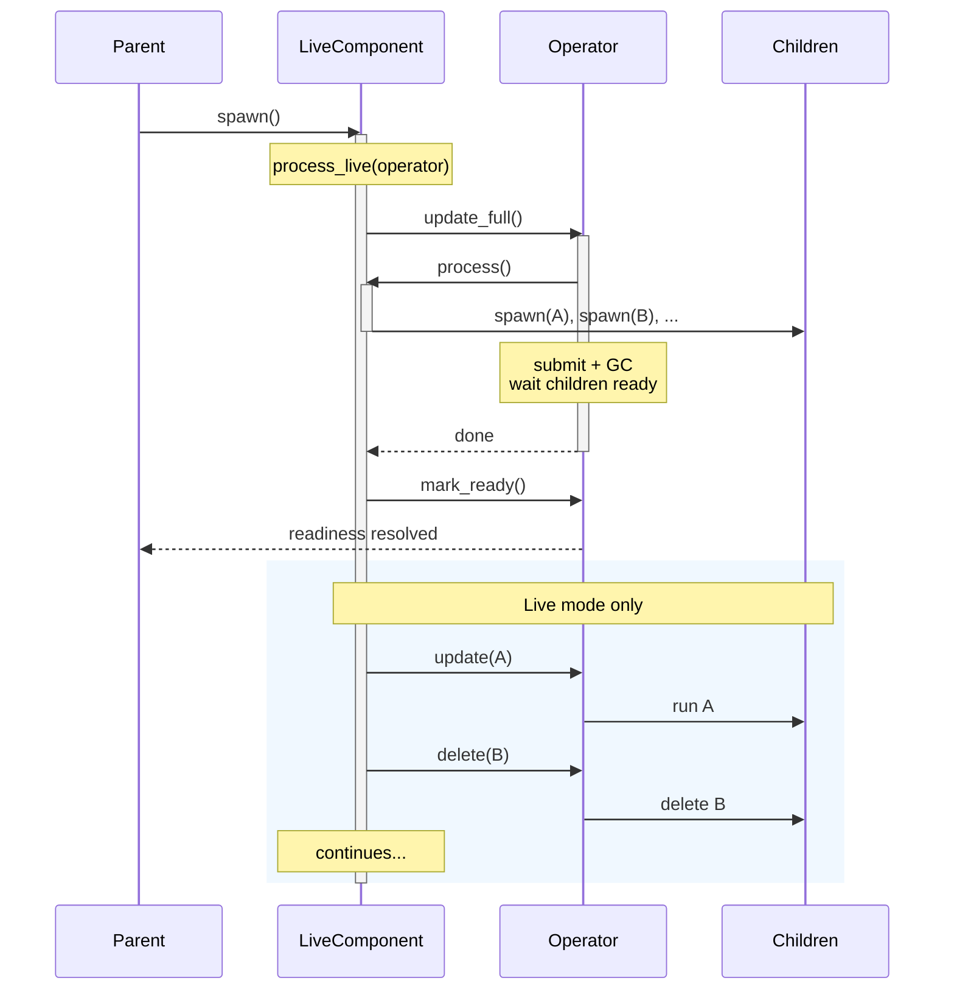

By default, a [processing component](../programming_guide/processing_component) runs in **catch-up mode** — on each `app.update()`, it declares all target states and mounts all sub-components from scratch. Synor handles incremental updates by skipping [memoized](../programming_guide/function) sub-components and reconciling target states at the end, then the component exits. This works well when the dataset is small enough to scan fully each cycle.

When the dataset is large or you need to react to changes continuously (e.g., watching a file system), you want the component itself to stay running and react incrementally. A **live component** does an initial full scan (same as catch-up mode), then keeps running and reacts to individual changes without rescanning everything.

## The LiveComponent protocol

A live component is a class with three methods:

```python
class MyLiveComponent:
    def __init__(self, folder: pathlib.Path, target: localfs.DirTarget) -> None:
        """Receive arguments from the spawn() call."""
        self.folder = folder
        self.target = target

    async def process(self) -> None:
        """Full processing — mount all children, declare all target states."""
        ...

    async def process_live(self, operator: syn.LiveComponentOperator) -> None:
        """Continuous processing — orchestrate full and incremental updates."""
        ...
```

- **`__init__`** receives arguments passed to `syn.spawn()`.
- **`process()`** does a full scan — mounts children via `syn.spawn()` and declares target states, just like a traditional component function. Called indirectly via `operator.update_full()`.
- **`process_live(operator)`** is the long-running entry point. It orchestrates full and incremental updates using the operator.

Synor detects a live component by checking if the class has both `process` and `process_live` methods.

## LiveComponentOperator

The `operator` passed to `process_live()` provides five methods:

| Method | Description |
|--------|-------------|
| `await operator.update_full()` | Run `process()` with a full submission phase (GCs removed children). Blocks until fully ready. |
| `await operator.update(subpath, fn, *args, **kwargs)` | Mount a child component incrementally. |
| `await operator.delete(subpath)` | Delete a child component. |
| `await operator.mark_ready()` | Signal that processing has caught up to the time `process_live()` was called. |
| `await operator.report_exception(exc)` | Surface a `process_live`-body exception through the parent's exception handler chain. |

### `update_full()`

Triggers a full processing cycle: calls `process()`, submits target states, waits for all children to be ready, and garbage-collects children that are no longer mounted. This is the same mechanism as a traditional component's update cycle.

Exceptions raised inside `process()` (or its descendants) are routed through the parent's [exception handler chain](./exception_handlers#exception-handlers), then propagate from `update_full()`. Reporting cannot convert a failed cycle into success. Retry-oriented wrappers such as `syn.auto_refresh` explicitly catch post-readiness cycle failures after reporting them; their initial cycle must still succeed.

### `update()` and `delete()`

Mount or delete individual child components without a full scan. These are concurrent with each other but serialized with `update_full()` — if `update_full()` is running, incremental operations wait until it finishes.

When multiple operations target the same subpath, only the latest one (by invocation order) takes effect.

Failures in the mounted child (or in the delete itself) are routed through the parent's [exception handler chain](./exception_handlers#exception-handlers) with `mount_kind="process_live"` and `stable_path` set to the *child's* path. The returned handle then raises from `ready()`. A live loop that wants to continue must catch that result explicitly.

### `mark_ready()`

Signals to the parent that the live component has caught up. The parent's `await handle.ready()` returns when `mark_ready()` is called. If `process_live()` returns without calling `mark_ready()`, it is called automatically.

### `report_exception()`

Routes an exception raised somewhere in `process_live`'s body — but **outside** an `update_full` / `update` / `delete` call — through the parent's [exception handler chain](./exception_handlers#exception-handlers). Use it for failures the framework can't see on its own, such as an external watcher emitting a malformed event:

```python
async def process_live(self, operator):
    await operator.update_full()
    await operator.mark_ready()
    async for event in watcher.events():
        try:
            subpath, value = parse_event(event)
        except ParseError as exc:
            await operator.report_exception(exc)
            continue
        await operator.update(subpath, process_one, value)
```

The handler receives an `ExceptionContext` with `mount_kind="process_live"` and `stable_path` set to the live component's own path. The full Python traceback is preserved (when `exc.__traceback__` is set — i.e. for caught exceptions). Falls back to ERROR-level logging if no handler is registered.

You **don't** need `report_exception` around `update_full` / `update` / `delete` themselves — those route their own errors automatically.

## Example: file system watcher

A component that watches a local folder and processes each file:

```python
import pathlib
import synor as syn

class FolderWatcher:
    def __init__(self, folder: pathlib.Path, target) -> None:
        self.folder = folder
        self.target = target

    async def process(self) -> None:
        """Full scan — mount a child for every file in the folder."""
        for path in self.folder.iterdir():
            if path.is_file():
                await syn.spawn(
                    syn.unit_path(path.name),
                    process_file,
                    path,
                    self.target,
                )

    async def process_live(self, operator: syn.LiveComponentOperator) -> None:
        # 1. Set up the file watcher before the full scan so no events are missed.
        watcher = setup_watchdog(self.folder)

        # 2. Full scan.
        await operator.update_full()

        # 3. Signal readiness — parent can proceed.
        await operator.mark_ready()

        # 4. React to changes.
        async for event in watcher.events():
            subpath = syn.unit_path(event.filename)
            if event.is_update:
                await operator.update(subpath, process_file, event.path, self.target)
            elif event.is_delete:
                await operator.delete(subpath)
```

The parent mounts it like any other component:

```python
@syn.task
async def app_main(folder: pathlib.Path, outdir: pathlib.Path) -> None:
    # Set up the target in the parent (call is not allowed inside process()).
    target = await localfs.mount_dir_target(outdir)
    # Mount the live component.
    await syn.spawn(FolderWatcher, folder, target)
```

## Example: traditional component equivalent

A traditional single-function component:

```python
@syn.task
async def process_all(data) -> None:
    for key, value in data.items():
        syn.ensure_target_state(target.target_state(key, value))
```

is equivalent to this LiveComponent:

```python
class ProcessAll:
    def __init__(self, data):
        self.data = data

    async def process(self) -> None:
        for key, value in self.data.items():
            syn.ensure_target_state(target.target_state(key, value))

    async def process_live(self, operator: syn.LiveComponentOperator) -> None:
        await operator.update_full()
        # mark_ready() is called automatically on return.
```

The key difference: the LiveComponent version can later be extended to handle incremental changes in `process_live()` without changing `process()`.

## Example: periodic refresh with `syn.auto_refresh`

A common pattern is "run a regular processor on a fixed schedule." `syn.auto_refresh` wraps any processor function as a LiveComponent that re-runs it on an interval — no need to write `process_live` yourself.

```python
import datetime
import synor as syn

async def sync_users(db, target) -> None:
    rows = await db.fetch_all_users()
    for row in rows:
        target.ensure_row(row=UserRow(...))

@syn.task
async def app_main(db, target) -> None:
    await syn.spawn(
        syn.auto_refresh(sync_users, interval=datetime.timedelta(minutes=5)),
        db, target,
    )
```

Behavior:
- The first cycle runs immediately, then `mark_ready` is signaled to the parent.
- In live mode, the loop continues: `sleep(interval) → run process_fn → ...` with a **fixed delay** between cycles (cycles never overlap; a slow cycle just stretches the gap).
- In catch-up mode, the first cycle runs and `auto_refresh` terminates — observationally identical to mounting `process_fn` directly. The interval is ignored.
- The first cycle must succeed before readiness. Later cycle failures are routed through the parent's [exception handler chain](./exception_handlers#exception-handlers), then explicitly caught by the auto-refresh wrapper so the next cycle can run.
- **Each cycle reconciles target states against the previous cycle.** If `process_fn` no longer declares some target state (e.g. a row that vanished from your source table), Synor automatically deletes the corresponding target — same garbage-collection model as a regular `syn.spawn` re-run. You write the function as if processing from scratch each time; the framework handles the diff. See [Target State](../programming_guide/target_state) for the underlying model.

The returned class's `__init__` accepts the same positional and keyword arguments as `process_fn` — anything you'd pass to `syn.spawn(process_fn, ...)` you can pass to `syn.spawn(syn.auto_refresh(process_fn, interval=...), ...)`.

## LiveMapFeed and LiveMapView
:::tip
For a user-facing introduction to live mode and when to use it, see [Live Mode](../programming_guide/live_mode). This section covers the protocol details for connector authors and advanced use cases.
:::

Two protocols represent live keyed collections that `spawn_each()` can consume. Choose based on whether your source can enumerate its current state:

- **`LiveMapView`** — the source has enumerable current state that can be scanned (e.g., a directory listing, database table). Supports both full scans via `__aiter__()` and incremental changes via `watch()`.
- **`LiveMapFeed`** — the source only streams changes, with no "current state" to scan (e.g., a Kafka consumer, a webhook event stream). Provides only `watch()`.

```python
class LiveMapFeed(Protocol[K, V]):
    async def watch(self, subscriber: LiveMapSubscriber[K, V]) -> None: ...

class LiveMapView(LiveMapFeed[K, V], Protocol[K, V]):
    def __aiter__(self) -> AsyncIterator[tuple[K, V]]: ...
```

`LiveMapView` extends `LiveMapFeed` — any `LiveMapView` is also a valid `LiveMapFeed`. When `spawn_each()` receives either protocol as its `items` argument, it automatically creates an internal `LiveComponent`:

- **`LiveMapView`**: `__aiter__()` yields all `(key, value)` pairs for full scans (called inside the internal `process()`). `watch()` handles the full lifecycle.
- **`LiveMapFeed`**: `process()` is a no-op (no snapshot to scan). All work happens in `watch()`.

### LiveMapSubscriber

The `subscriber` passed to `watch()` mirrors `LiveComponentOperator`:

| LiveMapSubscriber | LiveComponentOperator | Description |
|---|---|---|
| `await subscriber.update_all()` | `await operator.update_full()` | Full re-scan of all items |
| `await subscriber.mark_ready()` | `await operator.mark_ready()` | Signal readiness |
| `await subscriber.update(key, value)` | `await operator.update(subpath, fn, ...)` | Incremental update; returns `SpawnHandle` |
| `await subscriber.delete(key)` | `await operator.delete(subpath)` | Incremental delete; returns `SpawnHandle` |

A typical `watch()` implementation for a `LiveMapView`:

```python
async def watch(self, subscriber: LiveMapSubscriber[K, V]) -> None:
    await subscriber.update_all()     # initial full scan
    await subscriber.mark_ready()     # signal readiness
    # ... watch for changes and call subscriber.update()/delete() ...
```

### Implementing live support for a connector

To add live support to a source connector, make your source return an object that implements `LiveMapView` (if the source has scannable state) or `LiveMapFeed` (if it only streams changes):

- **`LiveMapView` example**: The [`localfs`](../connectors/localfs) connector's `DirWalker` — `walk_dir(..., live=True).items()` returns a `LiveMapView` backed by `watchfiles`.
- **`LiveMapFeed` example**: The [`kafka`](../connectors/kafka) connector — `topic_as_map()` returns a `LiveMapFeed` that consumes messages from Kafka topics.

### Single-subscriber contract

A live feed — `LiveMapView`, `LiveMapFeed`, or `LiveStream` — is **single-subscriber**. Its `watch()` typically owns an exclusive underlying resource (a consumer subscription, an OS file watch, a single in-memory change channel) that can't be fanned out to two concurrent callers — e.g. two subscriptions would race one consumer's offset commits. So a given feed instance supports **one active `watch()` (one `spawn_each`) at a time**; consuming it from two places concurrently is unsupported. Fan-out to multiple subscribers, if ever needed, belongs in a layer above the feed.

Enforce this in your `watch()` with `synor.connectorkits.SingleWatcherGuard`, which raises `RuntimeError` on a second concurrent call:

```python
from synor.connectorkits import SingleWatcherGuard

class MyView:
    def __init__(self, ...) -> None:
        self._watch_guard = SingleWatcherGuard("MyView")

    async def watch(self, subscriber) -> None:
        with self._watch_guard:
            ...  # existing body
```

## LiveStream

Some change sources are not naturally keyed maps — they deliver opaque event payloads (e.g. cloud-storage event notifications, raw message buses) that the consuming connector translates into map updates on its own terms. For these, Synor provides **`LiveStream`**: a keyless sibling of `LiveMapFeed` — an unkeyed sequence of messages without any "key" or "delete" semantics. Connectors typically wrap a user-supplied `LiveStream` into their own `LiveMapView` (or `LiveMapFeed`) by translating each event into the appropriate key-level operation.

```python
class LiveStream(Protocol[M]):
    async def watch(self, subscriber: LiveStreamSubscriber[M]) -> None: ...

class LiveStreamSubscriber(Protocol[M]):
    async def send(self, message: M) -> ReadyAwaitable: ...
    async def mark_ready(self) -> None: ...

class ReadyAwaitable(Protocol):
    async def ready(self) -> None: ...
    async def outcome(self) -> ReadinessOutcome: ...
```

`send()` is awaited by the producer to obtain a `ReadyAwaitable` handle. Durable source connectors await its typed `outcome()` and acknowledge external progress only for `Succeeded`; `Failed`, `Cancelled`, and `Superseded` are not acknowledgements. `ready()` remains available for ordinary callers that prefer raising semantics, but a handle with only `ready()` is not sufficient for broker acknowledgement.

Awaiting `send()` bounds only the call that creates the handle, not the work represented by that handle. A transport must therefore impose its own readiness-admission window and retain each slot until the corresponding message crosses the transport's contiguous acknowledgement frontier. Kafka and Iggy use a private 256-message window: Kafka pauses assigned partitions while full but continues short heartbeat polls, while Iggy stops pulling from its async iterator. This bounds both pending handles and later-completed messages blocked behind an earlier slow offset.

`mark_ready()` must return promptly — it is awaited inline in the producer's loop. Subscribers that need to wait on additional preconditions (e.g. a pending scan) should spawn a background task and return.

### Implementing a LiveStream-based connector

A connector built on `LiveStream` typically:

1. Accepts a user-supplied `LiveStream[...]` as a constructor argument — the user wires up the underlying transport.
2. Wraps the stream into a `LiveMapView` (or `LiveMapFeed`): `__aiter__()` runs an initial scan if the source has scannable state; `watch()` subscribes to the stream and translates each event into `subscriber.update(key, value)` / `subscriber.delete(key)`.
3. Lets the underlying `LiveStream` handle offset commits, readiness signaling, and back-pressure.
4. Guards its `watch()` against concurrent subscription — see [Single-subscriber contract](#single-subscriber-contract) — with `connectorkits.SingleWatcherGuard`.

**Example**: The [`oci_object_storage`](../connectors/oci_object_storage#live-bucket-watching) connector takes a `LiveStream[bytes]` (typically [`kafka.topic_as_stream(...).payloads()`](../connectors/kafka#as-a-live-stream)) and translates OCI Object Storage events into bucket-keyed updates. The Kafka connector exposes `topic_as_stream()` precisely so that downstream connectors like this one can plug into Kafka without inheriting the keyed-map semantics of `topic_as_map()`.

## Live mode vs catch-up mode

See [Live Mode](../programming_guide/live_mode) for how the two modes are enabled at the app level and an overview of how they work.

For a manual `LiveComponent`, the mode controls whether `process_live()` continues running after `mark_ready()`:

- **Live mode** (`live=True`): `process_live()` continues after `mark_ready()` — the component keeps watching for changes.
- **Catch-up mode** (`live=False`, default): `process_live()` terminates as soon as `mark_ready()` is awaited. No code after `await operator.mark_ready()` executes, so the component behaves like a traditional one-shot processor.

This lets you use the same `LiveComponent` class in both modes without code changes.

## Restrictions

### No `call()` inside `process()`

`process()` may only call `syn.spawn()` (background child mounts). Any setup that requires `call()` — such as declaring target tables — must be done in the **parent** component before mounting the LiveComponent. This keeps the controller's provider set stable across full and incremental updates.

### Not allowed in `call()`

LiveComponent classes can only be used with `syn.spawn()` and `operator.update()`. Passing a LiveComponent class to `syn.call()` raises a `TypeError`.

:::tip
While LiveComponent classes cannot be passed to `spawn_each()`, you can get live watching behavior more easily using a [`LiveMapFeed` or `LiveMapView`](#livemapfeed-and-livemapview) — `spawn_each()` automatically creates an internal LiveComponent when it detects one.
:::

## Readiness

The parent's `await handle.ready()` returns when `mark_ready()` is called inside `process_live()`, regardless of whether `process_live()` is still running.



If `process_live()` returns without calling `mark_ready()`, it is called automatically — the parent will not hang.
